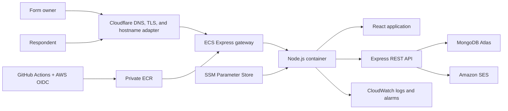
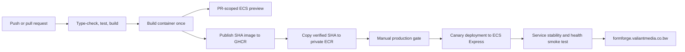

# FormForge

[](https://github.com/TshephangMogotsi/FormForge/actions/workflows/delivery.yml)
[](https://formforge.valiantmedia.co.bw)

FormForge is a production-deployed MERN form builder for creating, publishing,
collecting, and analyzing dynamic forms. It is built as a portfolio-quality
system: the repository records the API contracts, security boundaries,
architecture decisions, automated checks, and delivery path—not only the UI.

- **Live application:** [formforge.valiantmedia.co.bw](https://formforge.valiantmedia.co.bw)
- **Public demo:** [Customer experience pulse](https://formforge.valiantmedia.co.bw/f/customer-experience-pulse-b408a7eb)
- **Deployment history:** [GitHub Actions](https://github.com/TshephangMogotsi/FormForge/actions)

## What it demonstrates

- A responsive React form builder with drag-and-drop ordering and autosave.
- Immutable, versioned publishing behind stable public form links.
- Public submissions independently revalidated by the Express API.
- Paginated, version-aware response review with owner-wide and form-specific analytics.
- Registration, login, logout, session restoration, and password recovery.
- Revocable server-side sessions and single-use reset tokens stored as hashes.
- Amazon SES email delivery behind a provider-neutral notifier boundary.
- Docker delivery to AWS ECS Express Mode through short-lived GitHub OIDC credentials.
- A branded TLS endpoint through a narrowly scoped Cloudflare Worker route.

## Architecture



React and Express ship in one container and share one origin. The browser never
acts as the authorization boundary: the API validates every write, scopes owner
queries by authenticated user, and exposes public data only from an immutable
published snapshot. Submissions live in their own collection because their
growth and query patterns are unbounded relative to form definitions.

See [the architecture document](docs/ARCHITECTURE.md) for publishing,
submission, authentication, analytics, and scaling flows.

## Major engineering decisions

| Decision | Reason |
| --- | --- |
| Start with a modular monolith | One deployable unit keeps delivery and observability simple while domain modules preserve extraction boundaries. |
| Serve React and Express from one origin | HTTP-only session cookies work without cross-origin credential complexity. |
| Publish immutable form versions | Editing a draft cannot silently change an active public form or invalidate the meaning of older responses. |
| Advance a live-version pointer transactionally | A published snapshot and its public pointer cannot diverge during partial failure. |
| Store submissions separately | Response volume is unbounded and needs independent indexes, pagination, retention, and analytics. |
| Hash session and reset tokens | A database leak does not reveal bearer credentials; logout and password reset can revoke sessions server-side. |
| Aggregate analytics at read time first | Indexed MongoDB pipelines meet current volume without premature counters, queues, and reconciliation jobs. |
| Build once and deploy by commit SHA | Production receives the exact container that passed type-checking, tests, and the build gate. |
| Use OIDC instead of AWS access keys | GitHub receives short-lived, repository-scoped credentials without storing long-lived cloud secrets. |
| Adapt the hostname at the existing edge | A scoped Cloudflare Worker preserves the branded TLS origin without moving the existing DNS zone or adding a second CDN. |

The complete decision record, including rejected alternatives, is in
[docs/DECISIONS.md](docs/DECISIONS.md).

## Stack

| Layer | Technology |
| --- | --- |
| Client | React, TypeScript, Vite, dnd-kit |
| API | Node.js, Express, TypeScript, Zod |
| Data | MongoDB Atlas, Mongoose |
| Authentication | Opaque HTTP-only cookies, hashed MongoDB sessions |
| Email | Amazon SES |
| Delivery | Docker, GitHub Actions, AWS OIDC, ECR, ECS Express Mode |
| Edge | Cloudflare DNS, TLS, and Worker route |
| Verification | TypeScript compiler, Vitest integration tests, production builds |

## Local setup

### Prerequisites

- Node.js `22.12` or newer, below Node.js 25.
- npm.
- MongoDB Atlas or another MongoDB deployment. Publishing uses transactions, so
  a replica set is required to exercise the full workflow.

### Run the application

```bash
git clone https://github.com/TshephangMogotsi/FormForge.git
cd FormForge
npm ci
cp .env.example .env
npm run dev
```

Set `MONGODB_URI` in `.env` before starting. Keep credentials out of source
control; `.env` is ignored. The default development endpoints are:

- React: `http://localhost:5173`
- API: `http://localhost:4000`
- Liveness: `http://localhost:4000/api/health/live`
- Readiness: `http://localhost:4000/api/health/ready`

`CLIENT_ORIGIN` and `PUBLIC_APP_ORIGIN` should remain
`http://localhost:5173` locally. Password-reset and email-verification delivery are
optional during development and share the verified SES sender configured in
`PASSWORD_RESET_FROM_EMAIL`.

## Test and build status

Every pull request and push to `main` runs the same locked verification sequence:

```bash
npm run typecheck
npm test
npm run build
```

| Check | Current coverage |
| --- | --- |
| Type checking | Client and server TypeScript workspaces |
| Integration tests | 24 API tests covering auth, isolation, limits, health, drafts, duplication, publishing, submissions, and analytics |
| Browser tests | 5 Chromium flows covering responsive layout, throttled public forms, keyboard menus, destructive dialogs, and analytics drill-down |
| Production build | Compiled Express server and code-split Vite client |
| Preview delivery | PR-scoped ECS services with isolated databases and automatic teardown |
| Container publication | Immutable `sha-*` and `pr-*` images in GHCR or private ECR |
| Production smoke test | External `/api/health/ready` check after ECS service stabilization |

The badge at the top reflects the latest `main` verification result.

## Deployment flow



The production workflow selects an existing immutable ECR image rather than
rebuilding source. AWS access is assumed through GitHub OIDC, runtime secrets
are resolved from SSM Parameter Store, and rollback means deploying the previous
known-good SHA. Pull requests use separate preview roles, SSM parameters, and
logical databases, and their ECS service is removed when the PR closes. See
[docs/DEPLOYMENT.md](docs/DEPLOYMENT.md) for IAM boundaries, configuration,
launch gates, previews, and rollback strategy.

## Demo data

The optional idempotent seeder publishes a realistic customer-experience form
and creates 24 responses across seven days. For an existing account, only the
email is required.

```bash
DEMO_USER_EMAIL=demo@example.com npm run seed:demo --workspace server
```

Creating a new demo account also requires `DEMO_USER_PASSWORD` with at least
eight characters. Never commit that value.

## Repository map

```text
client/          React owner application and public form runtime
server/          Express API, domain services, repositories, and tests
infra/           Reviewable AWS IAM and registry foundation
docs/            Contracts, architecture, ADRs, roadmap, and runbooks
.github/         Verification, image publication, and production workflows
```

## Further documentation

- [Architecture](docs/ARCHITECTURE.md)
- [API contract](docs/API_CONTRACT.md)
- [Engineering decisions](docs/DECISIONS.md)
- [Deployment and operations](docs/DEPLOYMENT.md)
- [Product specification](docs/PRODUCT_SPEC.md)
- [Career alignment](docs/CAREER_ALIGNMENT.md)
- [Implementation roadmap](docs/IMPLEMENTATION_PLAN.md)
