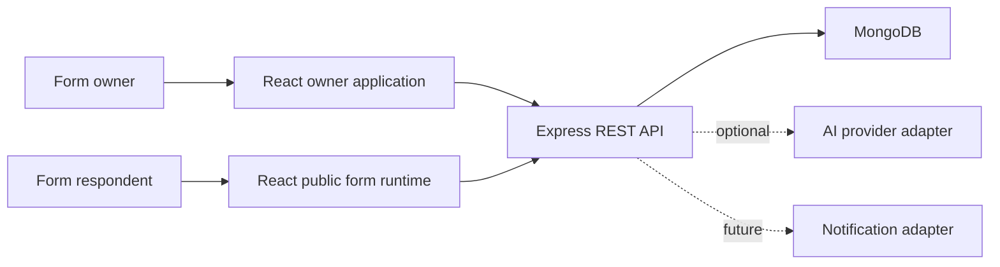
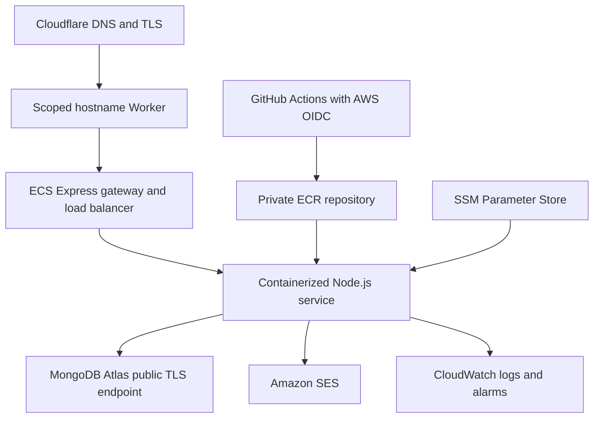

# FormForge architecture

## System context

FormForge is a modular MERN application with two user-facing surfaces:

- The authenticated owner application used to build forms and inspect results.
- The public form runtime used by respondents, often from mobile devices.

## Runtime responsibilities

### React client

- Owns interaction state, drag-and-drop behavior, previews, and accessible UI.
- Uses a small typed fetch boundary for the current API surface and local React
  state for transient builder interactions.
- Never acts as the authorization boundary.
- Keeps the public form route smaller than owner-only builder and analytics code.
- Lazy-loads builder and public-form bundles independently so respondents do not
  download drag-and-drop dependencies.

### Express API

- Authenticates users and enforces ownership.
- Validates requests with Zod before business logic executes.
- Coordinates domain services and persistence.
- Applies rate limits, safe errors, structured logs, and correlation IDs.
- Validates public submissions against the published form snapshot.
- Exposes process liveness separately from MongoDB-backed readiness. Readiness
  performs a bounded database ping and returns `503` while MongoDB is unavailable.

### MongoDB

- Stores users, hashed session and password-reset tokens with TTL expiry, and
  bounded form definitions.
- Stores unbounded submissions separately from forms.
- Uses indexes for owner dashboards, public slugs, and chronological response queries.

## Core data flow

### Publishing

1. The owner saves changes to the mutable draft.
2. The API validates the complete form definition.
3. A MongoDB transaction inserts a new immutable version and advances the form's
   live-version pointer together.
4. The public route resolves the stable slug and reads only the pointed snapshot.

### Draft editing

1. The builder loads the owner-scoped form through the REST API.
2. Dragging, ordering, and property edits remain immediate React interaction state.
3. After a short idle period, the client sends the complete bounded draft to one
   owner-scoped update endpoint and exposes pending, saving, saved, and failed states.
4. Zod validates stable UUIDs, field types, lengths, option constraints, and the
   maximum field count before MongoDB atomically replaces the embedded draft array.

### Submission

1. The public client loads a published form by slug.
2. The client validates for fast feedback.
3. The API independently validates field IDs, required values, types, and options.
4. The submission records the published form version used by the respondent.

Published snapshots and submissions are separate collections. The API exposes no
snapshot mutation path, and a submission stores only its version reference and
validated answers. Public submission writes have a tighter rate limit than the
general API boundary.

### Response review

1. The analytics landing page requests one workspace overview rather than issuing
   one analytics request per form.
2. The repository first selects form IDs by authenticated owner, then aggregates
   submissions only across that authorized set for workspace totals, a seven-day
   UTC trend, and per-form response counts.
3. Form-specific response queries paginate newest-first and return only the
   published field versions needed to label that page accurately.
4. Form-specific aggregations calculate dropdown counts without transferring every
   response into application memory.
5. The service fills missing trend dates and calculates percentages so the client
   receives stable presentation-ready contracts.

## Security boundaries

- Authentication establishes identity; authorization is checked per resource.
- Session cookies contain high-entropy opaque tokens; only SHA-256 token digests
  are stored in MongoDB, allowing logout and server-side revocation.
- Password-reset requests return the same response for known and unknown email
  addresses. Reset tokens are random, stored only as SHA-256 digests, expire,
  are consumed once, and revoke all existing sessions after a password change.
- Ownership is included in MongoDB read, update, and delete filters. An inaccessible
  resource returns `404` so its existence is not disclosed.
- Public slugs identify published forms but do not grant owner access.
- HTTP-only cookies are inaccessible to application JavaScript.
- SameSite cookies, JSON-only request bodies, origin-aware CORS, rate limiting,
  request-size limits, and security headers reduce common browser and API attacks.
- Secrets stay in runtime configuration and never enter logs or source control.
- Generated AI output and third-party responses are treated as untrusted input.
- Builder validation in the browser improves feedback but never replaces the API's
  authoritative validation of every persisted field definition.

## Production reference

The first production shape remains deliberately simple:

The React application and Express API are packaged in the same container and
served from one public origin. GitHub Actions verifies every proposed change.
The AWS deployment path assumes a narrowly scoped role through OIDC, pushes an
immutable commit-SHA image to ECR, and deploys that exact artifact rather than
rebuilding source independently. Runtime secrets are resolved by the ECS task
execution role from SSM Parameter Store.

Pull requests use a separate OIDC role, task roles, SSM path, and logical MongoDB
database. A PR-scoped ECS service provides a realistic same-origin preview and
is deleted automatically when the PR closes. Preview tasks have no permission
to read production parameters or send production email.

The Cloudflare Worker is an edge hostname adapter rather than an application
service: it applies only to the FormForge subdomain, preserves the request path,
and forwards to the generated ECS Express hostname over HTTPS. Authentication,
authorization, business logic, and data remain inside the same-origin MERN
application boundary.

Password-reset delivery is behind a notifier interface. The production adapter
uses the ECS application task role to call Amazon SES from one verified sender;
the domain service remains independent of AWS.

The no-cost MVP uses Atlas's public TLS endpoint because Free and Flex clusters do not
support PrivateLink and ECS Express tasks do not have stable public addresses. A broad
Atlas network access entry, when required, is an explicitly documented residual risk
with least-privilege credentials in SSM as a compensating control. PrivateLink remains
the upgrade path for paid production; `docs/ATLAS_NETWORKING.md` records the boundary,
verification checklist, and upgrade triggers.

ECS Express Mode is the preferred first AWS runtime because it provides a real
Fargate and Application Load Balancer deployment while reducing undifferentiated
networking setup. The IAM and registry foundation is provisioned separately so
it can be reviewed without creating continuously billed compute. EC2 remains an
acceptable alternative if operating cost or Atlas networking makes it the
better measured choice. Lambda and API Gateway are not introduced merely to
list services on a résumé.

## Scaling path

Scale vertically and add indexes before distributing the system. Likely later
pressure points are:

- Public-form reads: add caching for immutable published snapshots.
- Submission writes: use idempotency keys and queue non-critical side effects.
- Analytics: pre-aggregate or move heavy analysis away from request paths.
- Uploads: store blobs in S3-compatible storage and metadata in MongoDB.

Service extraction requires measured independent scaling, ownership, or
reliability needs—not hypothetical future traffic.
