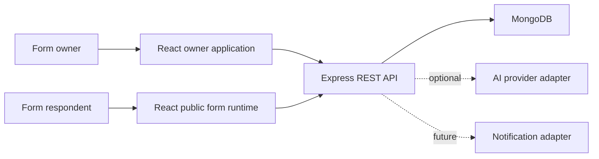
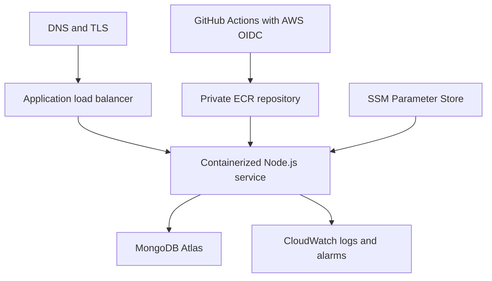

# FormForge architecture

## System context

FormForge is a modular MERN application with two user-facing surfaces:

- The authenticated owner application used to build forms and inspect results.
- The public form runtime used by respondents, often from mobile devices.

## Runtime responsibilities

### React client

- Owns interaction state, drag-and-drop behavior, previews, and accessible UI.
- Uses a small typed fetch boundary for the current API surface and local React
  state for transient builder interactions.
- Never acts as the authorization boundary.
- Keeps the public form route smaller than owner-only builder and analytics code.

### Express API

- Authenticates users and enforces ownership.
- Validates requests with Zod before business logic executes.
- Coordinates domain services and persistence.
- Applies rate limits, safe errors, structured logs, and correlation IDs.
- Validates public submissions against the published form snapshot.

### MongoDB

- Stores users, hashed session tokens with TTL expiry, and bounded form definitions.
- Stores unbounded submissions separately from forms.
- Uses indexes for owner dashboards, public slugs, and chronological response queries.

## Core data flow

### Publishing

1. The owner saves changes to the mutable draft.
2. The API validates the complete form definition.
3. Publishing copies the draft into an immutable, versioned snapshot.
4. The public route reads only the published snapshot.

### Submission

1. The public client loads a published form by slug.
2. The client validates for fast feedback.
3. The API independently validates field IDs, required values, types, and options.
4. The submission records the published form version used by the respondent.

## Security boundaries

- Authentication establishes identity; authorization is checked per resource.
- Session cookies contain high-entropy opaque tokens; only SHA-256 token digests
  are stored in MongoDB, allowing logout and server-side revocation.
- Ownership is included in MongoDB read, update, and delete filters. An inaccessible
  resource returns `404` so its existence is not disclosed.
- Public slugs identify published forms but do not grant owner access.
- HTTP-only cookies are inaccessible to application JavaScript.
- SameSite cookies, JSON-only request bodies, origin-aware CORS, rate limiting,
  request-size limits, and security headers reduce common browser and API attacks.
- Secrets stay in runtime configuration and never enter logs or source control.
- Generated AI output and third-party responses are treated as untrusted input.

## Production reference

The first production shape remains deliberately simple:

The React application and Express API are packaged in the same container and
served from one public origin. GitHub Actions verifies every proposed change.
The AWS deployment path assumes a narrowly scoped role through OIDC, pushes an
immutable commit-SHA image to ECR, and deploys that exact artifact rather than
rebuilding source independently. Runtime secrets are resolved by the ECS task
execution role from SSM Parameter Store.

ECS Express Mode is the preferred first AWS runtime because it provides a real
Fargate and Application Load Balancer deployment while reducing undifferentiated
networking setup. The IAM and registry foundation is provisioned separately so
it can be reviewed without creating continuously billed compute. EC2 remains an
acceptable alternative if operating cost or Atlas networking makes it the
better measured choice. Lambda and API Gateway are not introduced merely to
list services on a résumé.

## Scaling path

Scale vertically and add indexes before distributing the system. Likely later
pressure points are:

- Public-form reads: add caching for immutable published snapshots.
- Submission writes: use idempotency keys and queue non-critical side effects.
- Analytics: pre-aggregate or move heavy analysis away from request paths.
- Uploads: store blobs in S3-compatible storage and metadata in MongoDB.

Service extraction requires measured independent scaling, ownership, or
reliability needs—not hypothetical future traffic.
